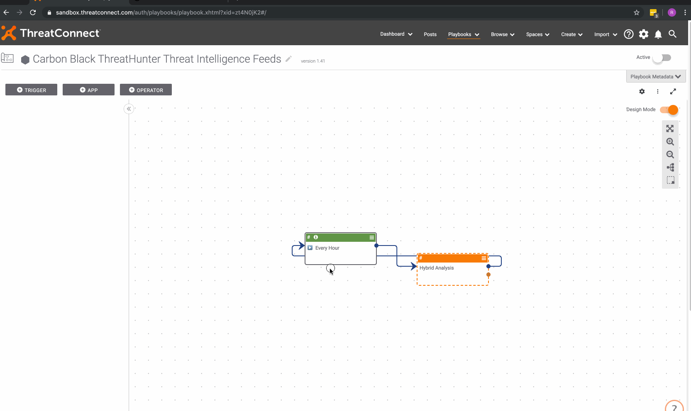

# CB Response ThreatConnect Integration

## Installation 

  1. Create a new Document in your Organization named "ThreatConnect Logo". Upload the `tc_logo.b64` as the file.
  2. Import the PBX file (this creates several new components). 
  3. Activate all new components.
  7. Activate the Playbook.

### Instructions for Query Indicators:

  1. Create a new custom indicator type called `CB-Watchlist`.
  2. Create a new attribute validation named `CB Query Type`. It should be a `SelectOne` with this rule: `Process;Binary`.
  3. Create 2 new system attributes assigned to the `CB-Watchlist` indicator type:
  	a. CB Query (limit 10k)
  	b. CB Query Type (limit 7, validation `CB Query Type`)
  4. Set the 2 attributes as default on the `CB Watchlist` indicator (optional).

## Usage

The Playbook is configured with an HttpLink Trigger. Use the trigger URL as the URL input in CB Response after clicking **+ Add New Feed**. There are 4 parameters allowed for filtering the data returned:

 - **owner**: The name of ID of the owner from which to pull.
 - **filters**: ThreatConnect API filters. See their [documentation]for a list of options.
 - **bulk**: Set to `true` to bring indicators back in bulk reports.
 - **score**: If bringing indicators back in bulk, what score should the reports get? (1-100)

 Example: `https://sandbox.threatconnect.com/api/playbook/ca691eca-55b5-43aa-be27-f6a2609b1e61?owner=Hybrid Analysis&filters=rating>3,confidence>50&bulk=true&score=75`
 

# CB ThreatHunter ThreatConnect Integration

## Installation

  1. Import the PBX file (this creates 3 new components). 
  2. Activate all 3 new components.
  3. Activate the Playbook and execute.

### Instructions for Query Indicators:

  1. Create a new custom indicator type called `CB-Watchlist`.
  2. Create a new attribute validation named `CB Query Type`. It should be a `SelectOne` with this rule: `Process;Binary`.
  3. Create 2 new system attributes assigned to the `CB-Watchlist` indicator type:
  	a. CB Query (limit 10k)
  	b. CB Query Type (limit 7, validation `CB Query Type`)
  4. Set the 2 attributes as default on the `CB Watchlist` indicator (optional).

## Usage

After the integration pushes the data to CB ThreatHunter, a user needs ot "Subscribe" to the feed.

 1. Select **Enforce** > **Watchlists**.
 2. In the upper right, select **Add watchlists**.
 3. Find your new feed(s), check the box on the left, and click **Subscribe**.

